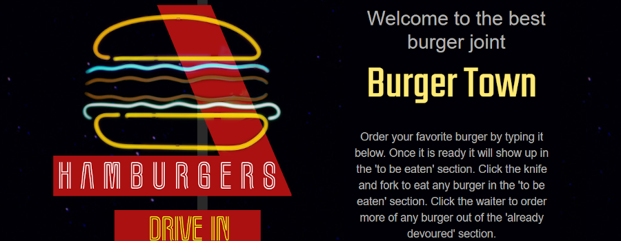

# Burger Town App

A burger logger with MySQL, Node, Express, Handlebars and an ORM.
Deployed link: https://blooming-depths-79016.herokuapp.com/

## Preview

## Description

You can play with this application on Heroku. This is an application which allows you to view, order, and consume your favorite burgers. Order your favorite burger by typing it in the input field. It will then show up in the 'to be eaten' section. Clicking on the the knife and fork will allow the user to 'eat' any burger in the 'to be eaten' section. The burger will then be put into the 'already devoured'  Clicking the waiter to order more of any burger out of the 'already devoured' section.

## Why

This project showcases MySQL, Node, Express, Handlebars and an ORM. It follows the MVC design pattern; using Node and MySQL to query and route data in the app, and Handlebars to generate the HTML.

## Technologies Used 

HTML

CSS

Bootstrap

JavaScript

jQuery

AJAX

APIs

Node.js

Node.js packages (body-parser, express, express-handlebars, mysql)

Express.js

Handlebars.js

MySQL

Heroku
